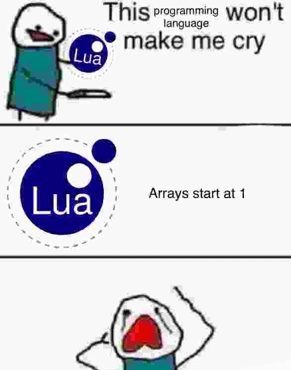

+++
title = "Why I'm Learning Lua in 2024"
date = 2024-05-22
+++

There is an abosulte wealth of programming languages to choose from these days, and recently I’ve decided to pick up Lua.

So out of all of the languages out there, why Lua?

I won’t waste your time:

- It’s super similar to Python
- Neovim plugins are written in Lua
- I’m learning Love2D (game dev framework which uses Lua)

My reasons are actually based on practicality (for once, lol) rather than hype or something else.

Here’s a bit of a more in-depth explanation for my choice and why I think Lua could be a great language to learn (if you’re doing similar stuff to me!)

Let’s get into it.

### Similarity to Python (and JavaScript)

Lua, like Python and JavaScript, is a dynamically-typed programming language.

Python is the programming language I’m most familiar with, and I know a decent bit of JavaScript too. As Lua is similar both conceptually and syntactically, I’m hoping that it won’t take me too long to get up to speed with it.

The only thing to be careful of is the customary starting indexing at [1] instead of [0].

### Neovim Plugins and Compatability

As someone interested in Linux and Unix it’s almost a rite of passage to try and give vim a go.

I started using Neovim and even made some guides on it, and all of the configuration is done in Lua.

Although I managed to understand the configuration process quite well, I do feel like having a better grasp of Lua will only making configuring Neovim easier.

As an aside, Neovim plugins are also written in Lua, so if I ever want to write some plugnis knowing how Lua works is going to be super helpful. If you’re thinking of checking out Neovim or use it right now, Lua might be for you too!

### Love2D and Game Development

As someone who used to be practically obsessed with video games, I never really ventured into game development. My main experience is more data and web-focused.

I decided that I want to learn more about it and try making a game, so I’ve been following CS50s Game Development course on YouTube.

The course uses Love2D, a kind of game engine (more like a framework?) built in C++, which uses Lua as a scripting language. Love2D is pretty interesting as it seems (at least to someone with no experience in game dev) to sit somewhere between super low-level and super abstracted. There’s a lot of handy built-in functions, but you still have to set up much of it yourself by the looks of things.

I think this is great because it will help me understand more lower-level game development concepts, and also I quite like the coding aspect of it.

I’m also a big believer in VDD (Vibe Driven Development). I likethe name Love2D. Sounds cool. Community seems nice. Has good vibes.

Lua apparently also has a reputation for being this kind of language that sits on top of super-fast embedded or low-level applications, to make use of the speed but with a nice programming experience. I think we can see this in both Neovim (written in C) and Love2D (C++ as previously mentioned).

This could also put you in good stead to learn embedded or interact with low-level code if you wanted to explore that too.

### Conclusion

Believe it or not I’m not here to try and persuade you one way or the other — just providing my reasons for exploring Lua. If you’re doing anything similar to what I am, maybe give it a try!

And please leave me a comment if you’re interested in Lua or you already code with it. Would be nice to chat to you guys.

I hope you enjoyed!

Jack
